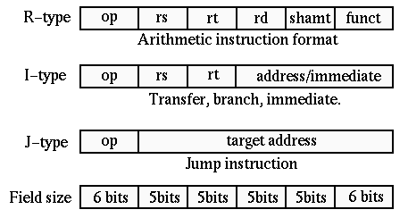

# Design of 5-Stage Pipelined MIPS32 RISC Processor

This repository contains the details and Verilog implementation of a MIPS32 ISA-based RISC Processor, designed with a 5-stage pipelined architecture.

---

## Table of Contents
1. [Abstract](#abstract)  
2. [Introduction](#introduction)  
3. [Design and Implementation](#design-and-implementation)  
   - [ISA Overview](#isa-overview)  
   - [Datapath Diagrams](#datapath-diagrams)  
   - [Modules](#modules)  
4. [Results and Verification](#results-and-verification)  
5. [Conclusion](#conclusion)  
6. [How to Run](#how-to-run)  
7. [References](#references)  

---

## Abstract
The objective of this project is to design and implement a 32-bit processor using Icarus Verilog and GTKWave, based on the Microprocessor with Interlocked Pipeline Stages (MIPS) instruction set. The processor follows the properties of the original MIPS architecture and demonstrates pipelined instruction execution with improved throughput.

---

## Introduction

Modern processors use pipelining to improve instruction throughput by overlapping the execution of multiple instructions. Instead of executing one instruction at a time, pipelining allows different stages of multiple instructions to be processed simultaneously, which significantly enhances performance.

This project implements a 32-bit MIPS32 processor using Verilog, following the classic 5-stage pipeline architecture:  
1. Instruction Fetch (IF)  
2. Instruction Decode (ID)  
3. Execution (EX)  
4. Memory Access (MEM)  
5. Write Back (WB)  

The MIPS32 ISA was chosen for its simplicity and widespread academic use in demonstrating computer architecture concepts. The objective of this project is to design, implement, and verify the pipelined processor using Icarus Verilog for simulation and GTKWave for waveform analysis.

---

## Design and Implementation

### ISA Overview

The implemented processor is based on the **MIPS32 Instruction Set Architecture (ISA)**, a classic RISC architecture used widely in both academia and industry.  
MIPS32 uses a **fixed 32-bit instruction length** and supports three standard instruction formats: R-type, I-type, and J-type.  

---

#### 1. Instruction Format Types

MIPS32 instructions are classified into three primary formats:

| Type  | Purpose                          | Example Instructions       |
|-------|----------------------------------|----------------------------|
| R-type | Register arithmetic/logical ops | add, sub, and, or, slt     |
| I-type | Immediate, load/store, branches | addi, lw, sw, beq, bne     |
| J-type | Jumps                           | j, jal                     |

---

#### 2. Common Instruction Fields

| Field   | Description                                          |
|---------|------------------------------------------------------|
| opcode  | Identifies instruction type (6 bits)                |
| rs      | First source register (5 bits)                      |
| rt      | Second source register or destination in I-type (5) |
| rd      | Destination register in R-type (5 bits)             |
| shamt   | Shift amount (5 bits, used in shift instructions)   |
| funct   | Function code (6 bits, specifies exact ALU op)      |
| imm     | Immediate constant (16 bits, sign-extended in I-type) |
| address | Target address (26 bits in J-type)                  |

---

#### 3. Instruction Format Layouts  

The MIPS32 ISA uses three standard instruction formats: **R-type, I-type, and J-type**.  
Below is the diagram representation of their bit-level layouts:  

  

##### R-Type (Register Operations)
- Used for arithmetic and logical operations on registers.  

| Field | opcode | rs   | rt   | rd   | shamt | funct |
|-------|--------|------|------|------|-------|-------|
| Bits  | 6      | 5    | 5    | 5    | 5     | 6     |
| Range | 31–26  | 25–21| 20–16| 15–11| 10–6  | 5–0   |

**Example:** `add $t1, $t2, $t3`  
- opcode = `000000`  
- funct = `100000`  

---

##### I-Type (Immediate, Load/Store, Branch)
- Used for arithmetic with immediates, memory access, and conditional branching.  

| Field | opcode | rs   | rt   | immediate |
|-------|--------|------|------|-----------|
| Bits  | 6      | 5    | 5    | 16        |
| Range | 31–26  | 25–21| 20–16| 15–0      |

**Example:** `addi $t1, $t2, 10`  
- opcode = `001000`  

---

##### J-Type (Jump)
- Used for unconditional jumps with 26-bit address.  

| Field | opcode | address |
|-------|--------|---------|
| Bits  | 6      | 26      |
| Range | 31–26  | 25–0    |

**Example:** `j target`  
- opcode = `000010`  

---

#### 4. Instruction Behavior Examples

| Instruction      | Format | Operation Description               |
|------------------|--------|-------------------------------------|
| add  $rd,$rs,$rt | R-type | $rd ← $rs + $rt                     |
| sub  $rd,$rs,$rt | R-type | $rd ← $rs - $rt                     |
| and  $rd,$rs,$rt | R-type | $rd ← $rs & $rt                     |
| addi $rt,$rs,imm | I-type | $rt ← $rs + imm (sign-extended)     |
| lw   $rt,off($rs)| I-type | $rt ← MEM[$rs + offset]             |
| sw   $rt,off($rs)| I-type | MEM[$rs + offset] ← $rt             |
| beq  $rs,$rt,off | I-type | if ($rs == $rt) PC ← PC+4+offset<<2 |
| j    target      | J-type | PC ← {PC[31:28], target, 00}        |

---

#### 5. Pipeline Relevance

- **R-type** → exercises ALU and register write-back.  
- **I-type (LW, SW, BEQ)** → demonstrates memory and control hazards.  
- **J-type** → introduces jump handling and control flow changes.  

This instruction subset ensures meaningful pipeline interactions such as **data forwarding, stalling, and hazard detection**.


### Datapath Diagrams
Two datapath representations are considered in this design:  
- **Non-pipelined Datapath** – instructions execute sequentially.  
- **Pipelined Datapath** – instructions are divided into five stages (IF, ID, EX, MEM, WB) for concurrent execution.  

*(Insert datapath diagrams here)*

### Modules
The processor design is divided into the following Verilog modules:  
- **Control Unit** – Generates control signals based on the opcode.  
- **Register File** – Stores and provides register data.  
- **ALU (Arithmetic Logic Unit)** – Performs arithmetic and logical operations.  
- **Pipeline Registers** – Store intermediate results between pipeline stages.  
- **Data Memory** – Handles load and store operations.  
- **Forwarding Unit & Hazard Detection Unit** – Resolve data hazards to maintain pipeline efficiency.  

---

## Results and Verification
The design was simulated using **Icarus Verilog** and verified using **GTKWave**.  

Key results include:  
- Correct execution of instructions such as `ADD`, `SUB`, `LW`, `SW`, `BEQ`, and `J`.  
- Waveform verification confirming proper data flow across pipeline stages.  
- Console outputs showing updated register and memory values.  

*(Insert waveform screenshots and console logs here)*

---

## Conclusion
This project successfully demonstrates the design and implementation of a **5-stage pipelined MIPS32 processor**.  

**Achievements**:  
- Implemented a working pipelined datapath.  
- Verified correct instruction execution using simulation.  

**Limitations**:  
- Basic branch handling without advanced techniques.  
- Limited instruction subset.  

**Future Improvements**:  
- Implement branch prediction.  
- Add exception and interrupt handling.  
- Extend ISA support with more instructions.  

---

## How to Run

### Requirements
- Icarus Verilog  
- GTKWave  

### Steps
```bash
# Compile the design
iverilog -o mips32_sim.out top_module.v testbench.v

# Run the simulation
vvp mips32_sim.out

# View waveforms
gtkwave dump.vcd

