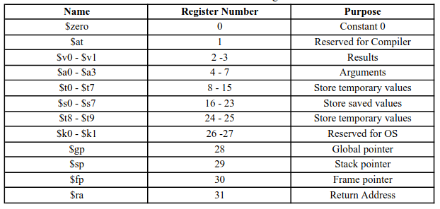
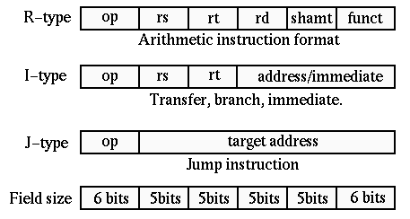
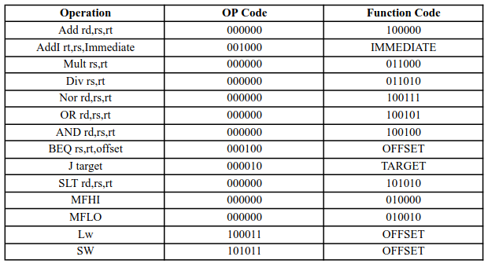
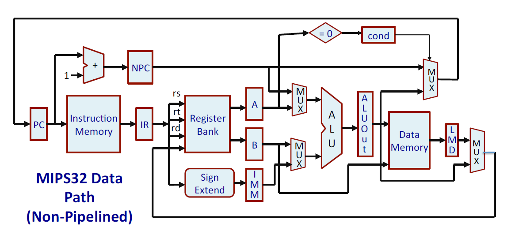
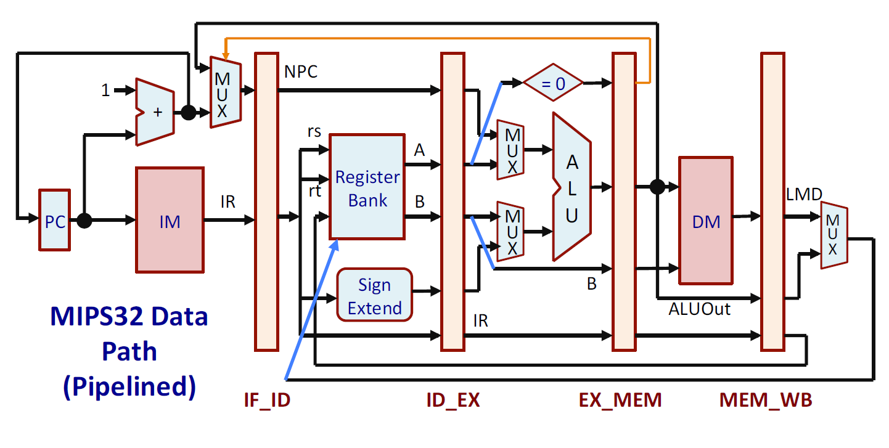
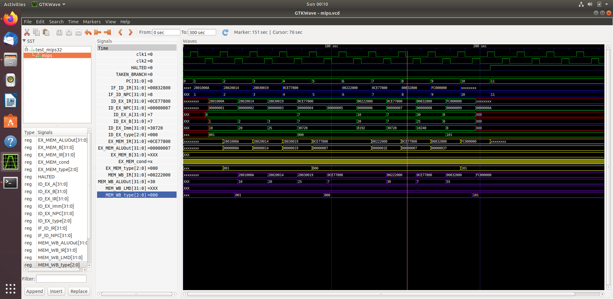

# Design of 5-Stage Pipelined MIPS32 RISC Processor

This repository contains the details and Verilog implementation of a MIPS32 ISA-based RISC Processor, designed with a 5-stage pipelined architecture.

---

## Table of Contents
1. [Abstract](#abstract)  
2. [Introduction](#introduction)  
3. [Design and Implementation](#design-and-implementation)  
   - [ISA Overview](#isa-overview)  
   - [Datapath Diagrams](#datapath-diagrams)  
   - [Modules](#modules)  
4. [Results and Verification](#results-and-verification)  
5. [Conclusion](#conclusion)  
6. [How to Run](#how-to-run)
7. [Known issues and problems](#known-problems-and-issues)
8. [References](#references)  

---

## Abstract
The objective of this project is to design and implement a 32-bit processor using Icarus Verilog and GTKWave, based on the Microprocessor with Interlocked Pipeline Stages (MIPS) instruction set. The processor follows the properties of the original MIPS architecture and demonstrates pipelined instruction execution with improved throughput.

---

## Introduction

Modern processors use pipelining to improve instruction throughput by overlapping the execution of multiple instructions. Instead of executing one instruction at a time, pipelining allows different stages of multiple instructions to be processed simultaneously, which significantly enhances performance.

This project implements a 32-bit MIPS32 processor using Verilog, following the classic 5-stage pipeline architecture:  
1. Instruction Fetch (IF)  
2. Instruction Decode (ID)  
3. Execution (EX)  
4. Memory Access (MEM)  
5. Write Back (WB)  

The MIPS32 ISA was chosen for its simplicity and widespread academic use in demonstrating computer architecture concepts. The objective of this project is to design, implement, and verify the pipelined processor using Icarus Verilog for simulation and GTKWave for waveform analysis.

---

## Design and Implementation

### ISA Overview

The implemented processor is based on the **MIPS32 Instruction Set Architecture (ISA)**, a classic RISC architecture used widely in both academia and industry.  
MIPS32 uses a **fixed 32-bit instruction length** and supports three standard instruction formats: R-type, I-type, and J-type.  

---

#### 1. Instruction Format Types

MIPS32 instructions are classified into three primary formats:

| Type  | Purpose                          | Example Instructions       |
|-------|----------------------------------|----------------------------|
| R-type | Register arithmetic/logical ops | add, sub, and, or, slt     |
| I-type | Immediate, load/store, branches | addi, lw, sw, beq, bne     |
| J-type | Jumps                           | j, jal                     |

---

#### 2. Common Instruction Fields

| Field   | Description                                          |
|---------|------------------------------------------------------|
| opcode  | Identifies instruction type (6 bits)                |
| rs      | First source register (5 bits)                      |
| rt      | Second source register or destination in I-type (5) |
| rd      | Destination register in R-type (5 bits)             |
| shamt   | Shift amount (5 bits, used in shift instructions)   |
| funct   | Function code (6 bits, specifies exact ALU op)      |
| imm     | Immediate constant (16 bits, sign-extended in I-type) |
| address | Target address (26 bits in J-type)                  |

- **MIPS Register File** 



---

#### 3. Instruction Format Layouts  

The MIPS32 ISA uses three standard instruction formats: **R-type, I-type, and J-type**.  
Below is the diagram representation of their bit-level layouts:  

  

##### R-Type (Register Operations)
- Used for arithmetic and logical operations on registers.  

| Field | opcode | rs   | rt   | rd   | shamt | funct |
|-------|--------|------|------|------|-------|-------|
| Bits  | 6      | 5    | 5    | 5    | 5     | 6     |
| Range | 31–26  | 25–21| 20–16| 15–11| 10–6  | 5–0   |

**Example:** `add $t1, $t2, $t3`  
- opcode = `000000`  
- funct = `100000`  

---

##### I-Type (Immediate, Load/Store, Branch)
- Used for arithmetic with immediates, memory access, and conditional branching.  

| Field | opcode | rs   | rt   | immediate |
|-------|--------|------|------|-----------|
| Bits  | 6      | 5    | 5    | 16        |
| Range | 31–26  | 25–21| 20–16| 15–0      |

**Example:** `addi $t1, $t2, 10`  
- opcode = `001000`  

---

##### J-Type (Jump)
- Used for unconditional jumps with 26-bit address.  

| Field | opcode | address |
|-------|--------|---------|
| Bits  | 6      | 26      |
| Range | 31–26  | 25–0    |

**Example:** `j target`  
- opcode = `000010`  

---

#### 4. Instruction Behavior Examples

- **Opcode Reference Table (for quick lookup)**



Example Instructions

| Instruction      | Format | Operation Description               |
|------------------|--------|-------------------------------------|
| add  $rd,$rs,$rt | R-type | $rd ← $rs + $rt                     |
| sub  $rd,$rs,$rt | R-type | $rd ← $rs - $rt                     |
| and  $rd,$rs,$rt | R-type | $rd ← $rs & $rt                     |
| addi $rt,$rs,imm | I-type | $rt ← $rs + imm (sign-extended)     |
| lw   $rt,off($rs)| I-type | $rt ← MEM[$rs + offset]             |
| sw   $rt,off($rs)| I-type | MEM[$rs + offset] ← $rt             |
| beq  $rs,$rt,off | I-type | if ($rs == $rt) PC ← PC+4+offset<<2 |
| j    target      | J-type | PC ← {PC[31:28], target, 00}        |

---

#### 5. Pipeline Relevance

- **R-type** → exercises ALU and register write-back.  
- **I-type (LW, SW, BEQ)** → demonstrates memory and control hazards.  
- **J-type** → introduces jump handling and control flow changes.  

This instruction subset allows observation of pipeline behavior such as data dependencies, branch handling, and the need for hazard management in pipelined execution.

- - -
### Datapath Diagrams

Two datapath representations are considered in this design:

- **Non-Pipelined Datapath** – Executes one complete instruction per clock cycle.
- **5-Stage Pipelined Datapath** – Divides instruction execution into IF, ID, EX, MEM, and WB stages to improve throughput.

---

#### Non-Pipelined Datapath



In the non-pipelined design:

- Entire instruction completes in a single clock cycle.
- No pipeline registers are used.
- Clock period is determined by the slowest instruction (typically `lw`).
- No hazards occur since only one instruction executes at a time.

This model serves as the conceptual foundation for the pipelined architecture.

---

#### 5-Stage Pipelined Datapath



In the pipelined architecture:

- Instruction execution is divided into five stages:
  - IF – Instruction Fetch  
  - ID – Instruction Decode / Register Read  
  - EX – ALU Execution / Branch Evaluation  
  - MEM – Data Memory Access  
  - WB – Register Write Back  

- Pipeline registers used:
  - IF/ID  
  - ID/EX  
  - EX/MEM  
  - MEM/WB  

This segmentation enables multiple instructions to execute simultaneously in different stages, increasing overall instruction throughput.

---

### Hazard Handling in Pipeline

In a pipelined processor, multiple instructions run at the same time in different stages. 
Because of this, certain conflicts or dependencies can occur.

- Structural hazards are avoided by using separate instruction and data memory.
- Branch instructions are handled in the EX stage. If a branch is taken, incorrect instructions are prevented from updating registers using the `TAKEN_BRANCH` signal.
- Data hazards are not automatically handled in this design. To avoid errors, independent (dummy) instructions are inserted in the test program when needed.
- - -
### Modules

The project consists of two main Verilog modules:

---

#### 1. [`pipe_MIPS32.v`](src/pipe_MIPS32.v) – Processor Design

This module implements the complete 5-stage pipelined MIPS32 processor using a two-phase clock (`clk1` and `clk2`).

It includes:

- Program Counter (PC)
- Instruction Memory
- Data Memory
- 32 × 32 Register Bank
- Pipeline registers:
  - IF/ID  
  - ID/EX  
  - EX/MEM  
  - MEM/WB  
- ALU operations for arithmetic and logic instructions
- Branch handling using the `TAKEN_BRANCH` signal

All five pipeline stages (IF, ID, EX, MEM, WB) are implemented inside this module using separate `always` blocks.

---

#### 2. [`test_mips32.v`](tb/test_mips32.v) – Testbench

This module is used to verify the processor functionality.

It performs the following:

- Generates two-phase clock signals
- Initializes registers and memory
- Loads instructions into memory
- Displays final register outputs
- Generates waveform file (`mips.vcd`) for GTKWave analysis

## Results and Verification

The 5-stage pipelined MIPS32 processor was simulated using **Icarus Verilog** and verified using **GTKWave** for waveform analysis.

The testbench initializes the register file and instruction memory with a sample program. The processor is executed using a two-phase clock (`clk1` and `clk2`), and the behavior of each pipeline stage is observed through waveform signals.

---

### Waveform Analysis



The waveform confirms the correct functioning of the processor:

- Instructions move sequentially through the five pipeline stages (IF → ID → EX → MEM → WB).
- The Program Counter (PC) updates correctly for each instruction.
- The IF/ID, ID/EX, EX/MEM, and MEM/WB pipeline registers store intermediate values properly.
- ALU results are generated correctly during the EX stage.
- Arithmetic and immediate instructions execute correctly through the pipeline.
- The `TAKEN_BRANCH` signal is used to control branch behavior when branch instructions are executed.
- Register write-back occurs only in the WB stage.

The waveform clearly shows overlapping instruction execution, demonstrating proper pipelined behavior.

---

### Console Output Verification

At the end of simulation, the final register values are displayed:

```
   R1 - 10
   R2 - 20
   R3 - 25
   R4 - 30
   R5 - 55
```

This verifies that:

- Immediate instructions executed correctly.
- Arithmetic operations produced accurate results.
- Data moved correctly across pipeline stages.
- The final sum was successfully written back to the destination register.

---

Overall, the simulation results confirm that the processor correctly executes instructions and maintains proper pipeline operation under the tested program.

## Conclusion

This project demonstrates the design and simulation of a 32-bit **5-stage pipelined MIPS32 processor** using Verilog.  
The processor executes instructions across IF, ID, EX, MEM, and WB stages using a two-phase clock model and verifies correct functionality through simulation and waveform analysis.

### Achievements

- Designed and implemented a working 5-stage pipelined datapath.
- Successfully simulated instruction execution using Icarus Verilog.
- Verified correct pipeline behavior using GTKWave.
- Demonstrated proper register write-back and ALU operation.

### Limitations

- Data hazards are avoided using dummy instructions instead of automatic hazard detection.
- Branch handling is basic and resolved in the EX stage.
- Only a limited subset of MIPS32 instructions is supported.

### Future Improvements

- Implement forwarding and hazard detection logic.
- Add branch prediction mechanisms.
- Support a larger set of MIPS32 instructions.
- Convert the design to a single-clock, synthesis-friendly architecture.

- - -
## How to Run

### Requirements
- Icarus Verilog
- GTKWave

### Steps

1. Navigate to the project root directory.

2. Compile the design and testbench:

``` bash
iverilog -o mips32_sim.out src/pipe_MIPS32.v tb/test_mips32.v 
```

3. Run the simulation:

 ```bash
 vvp mips32_sim.out
 ```

4. Open the waveform file in GTKWave:
 ```bash
 gtkwave mips.vcd 
```
## Known Problems and Issues

The following limitations exist in the current design:

- Data hazards are not automatically resolved. Dummy instructions are inserted in the test program to avoid data dependency issues.
- Branch handling is basic and resolved in the EX stage.
- No forwarding or hazard detection logic is implemented.
- The design uses a two-phase clock model with simulation delays (`#`), making it unsuitable for direct hardware synthesis.

---

## References

[NPTEL \& IIT KGP 'Hardware Modeling using Verilog'- Prof. Indranil Sengupta](https://nptel.ac.in/courses/106105165)